<a href="https://ahmednakhwa.online">
  
</a>

<p align="center">
  <a href="https://ahmednakhwa.online"></a>
  <a href="https://www.linkedin.com/in/ahmednakhwadev"></a>
  <a href="mailto:ahmednakhwa.dev@gmail.com"></a>
  <a href="https://instagram.com/ahmed._.nakhwa"></a>
</p>

<p align="center">
  
</p>

<p align="center">
  
</p>

<p align="center"><code>THE NIGHT IS DARK. THE CODE DOESN'T HAVE TO BE.</code></p>

---

## `> decrypt_identity`

```typescript
const ahmed = {
  alias: "The Debug Knight",
  role: "Incoming Data Analyst @ Deloitte USI",
  education: "B.E. EXTC @ TSEC Mumbai · 2024—2027",
  location: "Navi Mumbai, India",
  builds: ["Data Products", "Full-Stack Apps", "IoT Systems", "Embedded Tech"],
  core: ["C++", "Python", "SQL", "Power BI", "Next.js"],
  mindset: "Engineer by training. Vigilant builder by instinct.",
  status: "GOTHAM_BUILD_MODE_ON"
};
```

I’m **Ahmed Nakhwa** — an Electronics and Telecommunication engineer in the making who enjoys building at the intersection of **software, data, electronics, IoT, and people**.

My favourite part of engineering is taking an idea that exists only as a sketch, circuit, dataset, or rough thought and turning it into something people can actually use. From automated plant care and touch-controlled homes to business platforms and data dashboards, I like making complex things feel simple.

<p align="center">
  <a href="https://ahmednakhwa.online"></a>
</p>

---

## `// batcomputer_status`

| CURRENT STATUS | SIGNALS |
|---|---|
| 🟢 **Incoming Data Analyst @ Deloitte USI** | 🏆 **6× Diploma Semester Topper** |
| 🎓 **B.E. EXTC @ TSEC Mumbai** | ⚡ **MH-EXTC Rank 27 · AIR 1107** |
| 📍 **Navi Mumbai, India** | 🥇 **4× Project Competition Winner** |
| 🧠 **Software · Data · Embedded · IoT** | 🧩 **4× Inter-Collegiate Quiz Winner** |
| 🎤 **Speaker & Anchor — 10+ events** | 👑 **Best President — ISTE TSEC** |
| 🚀 **Project Lead — Team Legends** | 🤝 **Class Representative & Community Builder** |

---

## `// case_files`

<table>
  <tr>
    <td width="50%" valign="top">
      <h3>⚡ Multi-Division Corporate Platform</h3>
      <p>A responsive platform unifying engineering consultancy, sustainable homes, and interior services into one cohesive business experience.</p>
      <p><code>Next.js</code> <code>React</code> <code>Tailwind CSS</code> <code>Firebase</code></p>
      <a href="https://github.com/codewithahmed-dev/unus-group"></a>
    </td>
    <td width="50%" valign="top">
      <h3>🏠 Touch-Activated IoT Controller</h3>
      <p>An ESP8266 and HC-05 based controller that brings conventional appliances into one mobile app, with authentication and usage reporting.</p>
      <p><code>C++</code> <code>ESP8266</code> <code>Arduino</code> <code>Firebase</code></p>
      <strong>Designed for up to 80% lower smart-control cost.</strong><br/><br/>
      <a href="https://ahmednakhwa.online/#projects"></a>
    </td>
  </tr>
  <tr>
    <td width="50%" valign="top">
      <h3>🌱 Smart Plant Care Assistant</h3>
      <p>An ESP8266 + MQTT system that monitors soil conditions, automates water and fertilizer delivery, and generates downloadable reports.</p>
      <p><code>C++</code> <code>MQTT</code> <code>IoT Sensors</code> <code>Automation</code></p>
      <strong>Built to reduce crop destruction by more than 20%.</strong><br/><br/>
      <a href="https://ahmednakhwa.online/#projects"></a>
    </td>
    <td width="50%" valign="top">
      <h3>🔋 Smart Power Bank</h3>
      <p>A compact multi-cell BMS concept with STM32 control, safer fast charging, MQTT telemetry, and app-based battery and thermal monitoring.</p>
      <p><code>STM32</code> <code>BMS</code> <code>MQTT</code> <code>Mobile App</code></p>
      <strong>Turned into a competition-winning product story.</strong><br/><br/>
      <a href="https://ahmednakhwa.online/#projects"></a>
    </td>
  </tr>
</table>

---

## `// utility_belt`

<table>
  <tr>
    <td width="58%" valign="middle">
      <h3>BATCOMPUTER ONLINE</h3>
      <p>Languages, frameworks, data tools, and embedded hardware—each selected to solve the mission in front of me.</p>
      <p><code>ANALYZE</code> → <code>DESIGN</code> → <code>BUILD</code> → <code>SHIP</code></p>
    </td>
    <td width="42%" align="center">
      
    </td>
  </tr>
</table>

<p align="center">
  
</p>

<p align="center">
  
  
  
  
  
  
</p>

<details>
<summary><strong>🦇 Open the complete utility belt</strong></summary>
<br/>

| Layer | Tools |
|---|---|
| **Languages** | C · C++ · Python · Java · JavaScript · TypeScript · SQL |
| **Data & ML** | Pandas · NumPy · Matplotlib · Seaborn · Scikit-learn · Power BI · Excel |
| **Web & Databases** | React · Next.js · Tailwind CSS · MySQL · MSSQL · Firebase |
| **Embedded & IoT** | Arduino · ESP8266 · STM32 · Raspberry Pi · MQTT · Embedded C |
| **Build & Collaboration** | Git · GitHub · VS Code · Android Studio · Google Colab · Figma |
| **Project Delivery** | Agile · Scrum · SDLC · Jira · MS Project · PowerPoint |

</details>

---

## `// field_log`

```text
2026 → NEXT       Incoming Data Analyst · Deloitte USI
2025 → 2026       President · ISTE-TSEC (previously Head of Design)
2026              Web Development Intern · UNUS Group
2023              Engineering Intern · Saitronics
ACTIVE            Project Lead · Team Legends
```

<details open>
<summary><strong>Leadership + real-world work</strong></summary>
<br/>

- **UNUS Group — Web Development Intern:** Designed and developed a multi-division marketing platform; transformed business requirements into responsive service pages, project showcases, and clear contact journeys.
- **ISTE-TSEC — President, previously Head of Design:** Promoted for consistent leadership; secured 3–4 sponsors including Red Bull and Rio, and led events and workshops from planning through execution.
- **Saitronics — Engineering Intern:** Contributed to four engineering projects and translated requirements into working prototypes through hands-on development and collaboration.
- **Team Legends — Project Lead:** Build-focused leadership across technical projects, competitions, presentations, and community initiatives.

</details>

---

## `// training_protocols`

| Timeline | Institution | Chapter |
|---|---|---|
| **2024 — 2027** | **Thadomal Shahani College of Engineering, Mumbai** | B.E. Electronics & Telecommunication · Class Representative for 25 students |
| **2021 — 2024** | **Bharati Vidyapeeth Institute of Technology, Kharghar** | Diploma EXTC · **90.24%** · Topper across all six semesters · CR for 180 students |
| **2014 — 2021** | **D.Y. Patil School, Belapur** | SSC · Class Coordinator for 70 students · Red House Captain |

---

## `// evidence_vault`

| 🏆 Engineering | 🧠 Knowledge | 🎤 Leadership |
|---|---|---|
| State-Level Technical Paper Presentation Winner | 4× Inter-Collegiate Quiz Winner | Best President — ISTE TSEC |
| MSBTE Project Competition Winner | 6× Diploma Semester Topper | Anchored 10+ events |
| 2× TSEC Project Winner — 2025 & 2026 | MH-EXTC Rank 27 · AIR 1107 | Class Representative |
| 4× Project Competition Winner overall | Diploma — 90.24% | Project Lead — Team Legends |

---

## `// batcomputer_telemetry`

<p align="center">
  
  
  
</p>

<p align="center">
  
</p>

> [!IMPORTANT]
> **Fear is a tool. Curiosity is the protocol. Code is the weapon against unsolved problems.** Every build here is powered by practice, teamwork, and the discipline to keep shipping.

---

## `// light_the_signal`

<p align="center">
  <a href="https://ahmednakhwa.online"></a>
  <a href="https://www.linkedin.com/in/ahmednakhwadev"></a>
  <a href="mailto:ahmednakhwa.dev@gmail.com"></a>
</p>

<p align="center">
  
</p>

<p align="center">
  
</p>

<p align="center">
  <strong>Not the hero the backlog asked for—the builder it needed.</strong><br/>
  Data intelligence. Software execution. Hardware curiosity.<br/><br/>
  <code>BUILD IN SILENCE · DEBUG IN DARKNESS · SHIP WITH IMPACT</code>
</p>

<p align="center"><sub>Animated Gotham accents via <a href="https://giphy.com/explore/batman-signal">GIPHY</a> and coding animation by <a href="https://dribbble.com/shots/14272063-Batman">Abdullah Taher</a>.</sub></p>
