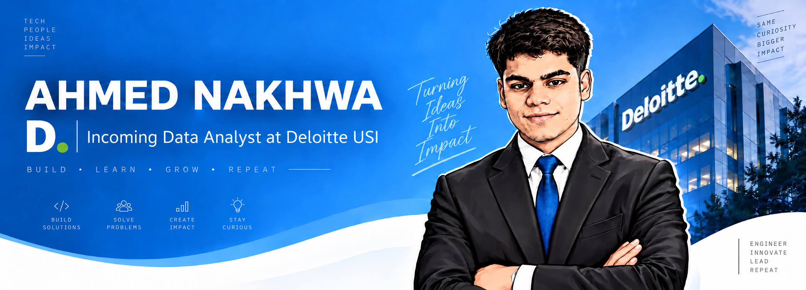

  

I’m an Electronics and Telecommunication Engineering student at TSEC Mumbai and an **Incoming Data Analyst at Deloitte USI**. I enjoy building at the intersection of data, software, embedded systems, and IoT — using Python, SQL, Power BI, C++, and modern web technologies.

Fast learner and eager to explore new technologies. Able to switch between data analytics, software development, embedded systems, and project leadership. Believer in practical learning, clean code, teamwork, and turning ideas into useful products.

Steadily growing into a data-focused technologist while continuing to build end-to-end projects. Outside technology, I’ve anchored 10+ events, won four project competitions and four quiz competitions, and received the Best President Award at ISTE TSEC.

---

### Want to Build Your Own?

Do you like my profile and want to build your own? It’s very simple. GitHub has a special profile README feature. For it to work:

1. Create a **public GitHub repository** with the same name as your username.
2. Add a `README.md` file to that repository.
3. Put some cool content about yourself in `README.md`.

That’s it — the README will automatically appear on your GitHub profile page.
