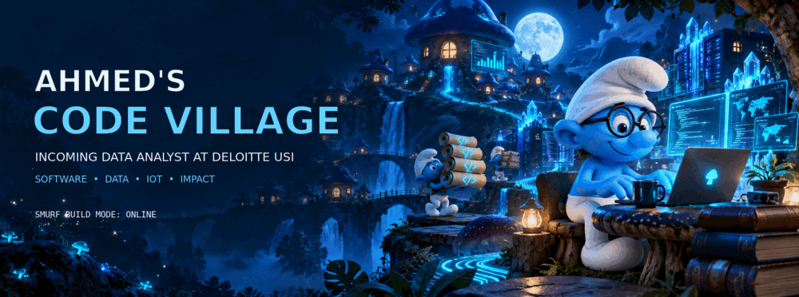
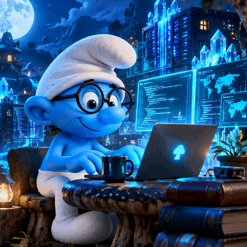

<a href="https://ahmednakhwa.online">
  
</a>

<p align="center">
  <a href="https://ahmednakhwa.online"></a>
  <a href="https://www.linkedin.com/in/ahmednakhwadev"></a>
  <a href="mailto:ahmednakhwa.dev@gmail.com"></a>
  <a href="https://instagram.com/ahmed._.nakhwa"></a>
</p>

<p align="center"><strong>CHOOSE YOUR VILLAGE QUEST</strong></p>

<p align="center">
  <a href="#meet-the-builder"></a>
  <a href="#software-project-village"></a>
  <a href="#builder-toolkit"></a>
  <a href="#smurf-arcade"></a>
  <a href="#journey-map"></a>
  <a href="#send-a-blue-signal"></a>
</p>

<p align="center">
  
</p>

<p align="center"><code>SMALL VILLAGE. BIG IDEAS. USEFUL CODE.</code></p>

## Meet the Builder

```typescript
const ahmed = {
  name: "Ahmed Nakhwa",
  role: "Incoming Data Analyst @ Deloitte USI",
  education: "B.E. EXTC @ TSEC Mumbai | 2024 to 2027",
  location: "Navi Mumbai, India",
  builds: ["Software", "Data Products", "IoT", "Embedded Systems"],
  core: ["C++", "Python", "SQL", "Power BI", "Next.js"],
  curiosityLevel: "Smurf-sized village, giant-sized ambition",
  status: "SMURF_BUILD_MODE_ON"
};
```

I am **Ahmed Nakhwa**, an Electronics and Telecommunication engineer who enjoys building at the intersection of **software, data, IoT, embedded systems, and people**.

I like turning rough ideas into useful products. A sketch can become an automated plant-care system, a circuit can become a connected home controller, and a business requirement can become a responsive web platform. My goal is simple: understand the real problem, build clearly, measure the result, and keep improving.

<p align="center">
  <a href="https://ahmednakhwa.online"></a>
</p>

## Village Status

<details open>
<summary><strong>🍄 Current build quest</strong></summary>
<br/>

- 🟢 **Incoming Data Analyst at Deloitte USI**
- 🎓 **B.E. EXTC at TSEC Mumbai | 2024 to 2027**
- 📍 **Navi Mumbai, India**
- 💻 Building across **software, data, embedded systems, and IoT**
- 🚀 Project Lead at **Team Legends**

</details>

<details>
<summary><strong>🏆 Achievement chest</strong></summary>
<br/>

- **6 times Diploma Semester Topper**
- **MH EXTC Rank 27 | AIR 1107**
- **4 times Project Competition Winner**
- **4 times Inter-Collegiate Quiz Winner**
- **Best President | ISTE TSEC**
- **Speaker and Anchor | 10+ events**
- **Class Representative and Community Builder**

</details>

## Software Project Village

Twelve builds across web, data, accessibility, IoT, embedded software, and communication engineering. Open any mushroom house to inspect the problem, build, stack, and result.

<details open>
<summary><strong>🍄 01 | Multi-Division Corporate Web Platform</strong> | Full Stack Web</summary>
<br/>

**Problem:** One company needed a clear digital identity for engineering consultancy, sustainable housing, and interior services without splitting the customer journey across separate websites.

**Build:** Designed a responsive business platform with reusable components, dynamic navigation, individual service journeys, project showcases, and focused contact sections. The interface turns three divisions into one consistent product story.

**Stack:** `Next.js` `React` `TypeScript` `Tailwind CSS` `Firebase`

**Result:** Delivered as the live UNUS Group company platform and used as a practical web-development internship project.

<a href="https://github.com/codewithahmed-dev/unus-group"></a>

</details>

<details>
<summary><strong>🌱 02 | Smart Plant Care Assistant</strong> | IoT Automation</summary>
<br/>

**Problem:** Manual watering and fertilizer routines are inconsistent and can damage plants when soil conditions are not observed at the right time.

**Build:** Created an ESP8266 and MQTT system that monitors soil conditions, triggers water and fertilizer delivery, sends moisture alerts, and prepares downloadable user reports. The companion software converts sensor readings into simple plant-care actions.

**Stack:** `C++` `ESP8266` `MQTT` `IoT Sensors` `Arduino` `Android`

**Impact:** Designed to reduce crop destruction by more than **20%**. Winner of the **2024 State-Level MSBTE Project Competition**.

<a href="https://ahmednakhwa.online/#projects"></a>

</details>

<details>
<summary><strong>🏠 03 | Touch-Activated IoT Controller</strong> | Mobile and Embedded</summary>
<br/>

**Problem:** Replacing every traditional appliance with a separate branded smart device is expensive and creates multiple disconnected control experiences.

**Build:** Developed a retrofit controller for fans, lights, and switches using wireless communication, fingerprint authentication, and a unified mobile application. The system supports remote control and appliance-level usage reporting.

**Stack:** `C++` `ESP8266` `HC-05` `Wi-Fi` `Firebase` `Mobile App`

**Impact:** Designed for up to **80% lower smart-control cost** compared with conventional smart-device solutions. Winner of the **2025 Departmental Project Competition**.

<a href="https://ahmednakhwa.online/#projects"></a>

</details>

<details>
<summary><strong>🔋 04 | Smart Powerbank</strong> | Connected Product</summary>
<br/>

**Problem:** Standard powerbanks hide useful information such as thermal condition, active outputs, and cell-level health from the user.

**Build:** Built a compact multi-cell powerbank concept with battery protection, safer fast charging, dual outputs, and app-based monitoring. MQTT telemetry communicates battery percentage, temperature status, and connected ports.

**Stack:** `STM32` `Embedded C` `BMS` `MQTT` `Mobile App`

**Result:** Converted a hardware prototype into a connected product story and won the **2026 Departmental Project Competition**.

<a href="https://ahmednakhwa.online/#projects"></a>

</details>

<details>
<summary><strong>👁️ 05 | Real-Time Object Detection for Blind Users</strong> | Assistive AI</summary>
<br/>

**Problem:** Visually impaired users need fast environmental awareness without depending on a screen-based interface.

**Build:** Developed an assistive computer-vision prototype that processes a live camera feed, identifies nearby objects, and converts detections into spoken feedback. The interaction is designed around clear audio cues rather than visual controls.

**Stack:** `Python` `OpenCV` `Object Detection` `Text to Speech`

**Status:** Accessibility-focused prototype exploring practical AI for independent navigation and daily awareness.

</details>

<details>
<summary><strong>🎙️ 06 | EduVoice Assistive Education Platform</strong> | Accessible Software</summary>
<br/>

**Problem:** Many learning platforms assume constant connectivity, visual navigation, and a one-size-fits-all learning pace.

**Build:** Designed a voice-first education experience for children with disabilities. The product concept includes personalized learning paths, offline access, simple spoken navigation, privacy-aware child profiles, and a device-support initiative.

**Stack:** `Python` `Voice UI` `Personalization` `Offline First` `Accessibility`

**Focus:** Inclusive learning with privacy considerations aligned to child-safety principles such as COPPA and GDPR-K.

</details>

<details>
<summary><strong>💬 07 | Python Support Chatbot</strong> | Conversational Software</summary>
<br/>

**Problem:** Repetitive user questions consume support time and slow down access to common information.

**Build:** Created a Python chatbot during the Ignitech internship experience. The flow organizes common questions, maps user inputs to useful responses, handles fallback cases, and keeps the conversation simple for first-time users.

**Stack:** `Python` `Conversation Flows` `Intent Handling` `FAQ Automation`

**Result:** Practical introduction to building software from a real support requirement and improving it through iterative testing.

</details>

<details>
<summary><strong>🧭 08 | Legends Community OS</strong> | Community Platform</summary>
<br/>

**Problem:** Technical communities often scatter projects, resources, teams, events, and achievements across unrelated tools.

**Build:** Designed a unified operating concept for Team Legends with dedicated spaces for headquarters, project labs, active builds, resources, chapter coordination, and an executive panel.

**Stack:** `Web Platform` `Workflow Design` `Content Systems` `Community Operations`

**Status:** Evolving product concept shaped by hands-on leadership, event execution, project coordination, and community building.

</details>

<details>
<summary><strong>⚖️ 09 | Digital Weighing Terminal</strong> | Embedded Software</summary>
<br/>

**Problem:** A weighing system needs stable sensor conversion, calibration, tare control, and a readable interface in a compact device.

**Build:** Programmed a load-cell terminal that reads HX711 measurements, applies calibration, supports button-based control, drives status feedback, and displays weight on an OLED. The design was explored with Arduino and STM32 hardware.

**Stack:** `C++` `STM32` `Arduino` `HX711` `Load Cell` `OLED`

**Result:** End-to-end embedded prototype covering sensor integration, control logic, display handling, and calibration.

</details>

<details>
<summary><strong>🕹️ 10 | Dual-Joystick Robotics Controller</strong> | Control Systems</summary>
<br/>

**Problem:** Multi-actuator prototypes become difficult to control when input, display feedback, and safety states are handled separately.

**Build:** Developed a controller architecture using dual joysticks for directional input, servo and stepper control, relay switching, buzzer feedback, and live display output. An extended version includes IR-based command input.

**Stack:** `STM32` `Embedded C` `Joysticks` `Servos` `Steppers` `OLED`

**Result:** A modular control prototype for experimenting with robotics, motor coordination, and human-machine interfaces.

</details>

<details>
<summary><strong>📡 11 | CDMA Walsh Code Simulator</strong> | Communication Software</summary>
<br/>

**Problem:** CDMA encoding and user separation can be difficult to understand without seeing the complete signal workflow.

**Build:** Programmed a two-user simulator that generates orthogonal Walsh codes, encodes binary data, combines transmitted signals, and recovers each user through correlation-based decoding.

**Stack:** `MATLAB` `GNU Octave` `Signal Processing` `CDMA` `Walsh Codes`

**Result:** Turns communication theory into a repeatable simulation with traceable inputs, encoded signals, and decoded outputs.

</details>

<details>
<summary><strong>📶 12 | Wireless Network Analytics Suite</strong> | Engineering Analytics</summary>
<br/>

**Problem:** Cellular planning concepts such as path loss, frequency reuse, interference, and handoff are easier to validate through data and plots than formulas alone.

**Build:** Created MATLAB and Octave experiments for free-space and log-distance path loss, C/I versus cluster size, channel allocation through frequency reuse, and handoff between two base stations using threshold and hysteresis logic.

**Stack:** `MATLAB` `GNU Octave` `Data Visualization` `Wireless Networks`

**Result:** A reusable academic analytics toolkit that converts communication-system equations into graphs, observations, and engineering decisions.

</details>

<p align="center">
  <a href="https://ahmednakhwa.online/#projects"></a>
</p>

## Builder Toolkit

<p align="center">
  
</p>

<p align="center">
  
</p>

<p align="center">
  
  
  
  
  
  
</p>

<details>
<summary><strong>🧰 Open the complete engineering toolkit</strong></summary>
<br/>

- **Languages:** C, C++, Python, Java, JavaScript, TypeScript, SQL
- **Data and ML:** Pandas, NumPy, Matplotlib, Seaborn, Scikit-learn, Power BI, Excel
- **Web and Databases:** React, Next.js, Tailwind CSS, MySQL, MSSQL, Firebase
- **Embedded and IoT:** Arduino, ESP8266, STM32, Raspberry Pi, MQTT, Embedded C
- **Build and Collaboration:** Git, GitHub, VS Code, Android Studio, Google Colab, Figma
- **Project Delivery:** Agile, Scrum, SDLC, Jira, MS Project, PowerPoint

</details>

## Smurf Arcade

### Game 1: Find the Bug

Which line stops the village counter from increasing correctly?

```python
berries = 5
for berry in range(3):
    berries =+ 1
print(berries)
```

<details>
<summary>🍄 Choice A: The starting value is wrong</summary>
<br/>
Not this one. Starting with five berries is valid.
</details>

<details>
<summary>🍄 Choice B: The loop range is wrong</summary>
<br/>
Not this one. The loop correctly runs three times.
</details>

<details>
<summary>💡 Choice C: The update operator contains the bug</summary>
<br/>
Correct. Use <code>berries += 1</code>. The original line assigns positive one on every loop instead of incrementing the value.
</details>

### Game 2: Open a Skill Mushroom

Pick a house before opening the others. Each house unlocks one part of my engineering stack.

<details>
<summary>🔵 Blue Mushroom House</summary>
<br/>
**Software unlocked:** C++, Python, Java, JavaScript, TypeScript
</details>

<details>
<summary>🍄 Data Mushroom House</summary>
<br/>
**Data unlocked:** SQL, Pandas, NumPy, Power BI, Scikit-learn
</details>

<details>
<summary>⚙️ Builder Mushroom House</summary>
<br/>
**Hardware unlocked:** STM32, ESP8266, Arduino, Raspberry Pi, MQTT
</details>

<details>
<summary>🌐 Web Mushroom House</summary>
<br/>
**Web unlocked:** React, Next.js, Tailwind CSS, Firebase, MySQL
</details>

### Game 3: Contribution Snake

<p align="center"><strong>Watch the village snake collect every contribution.</strong></p>

<picture>
  <source media="(prefers-color-scheme: dark)" srcset="https://raw.githubusercontent.com/codewithahmed-dev/codewithahmed-dev/output/github-contribution-grid-snake-dark.svg" />
  <source media="(prefers-color-scheme: light)" srcset="https://raw.githubusercontent.com/codewithahmed-dev/codewithahmed-dev/output/github-contribution-grid-snake.svg" />
  
</picture>

## Journey Map

```text
2026 to NEXT    Incoming Data Analyst | Deloitte USI
2025 to 2026    President | ISTE TSEC, previously Head of Design
2026            Web Development Intern | UNUS Group
2023            Engineering Intern | Saitronics
ACTIVE          Project Lead | Team Legends
```

<details open>
<summary><strong>💼 Open professional journey</strong></summary>
<br/>

- **UNUS Group | Web Development Intern:** Designed and developed a multi-division marketing platform with responsive service pages, project showcases, and clear contact journeys.
- **ISTE TSEC | President, previously Head of Design:** Progressed through leadership roles, secured sponsors including Red Bull and Rio, and led workshops and events from planning to execution.
- **Saitronics | Engineering Intern:** Contributed to four engineering projects and translated requirements into working prototypes through hands-on development and collaboration.
- **Team Legends | Project Lead:** Leads technical projects, competition preparation, presentations, and community initiatives.

</details>

## Education Village

<details open>
<summary><strong>🎓 B.E. Electronics and Telecommunication | 2024 to 2027</strong></summary>
<br/>

**Thadomal Shahani Engineering College, Mumbai**

- Class Representative for 25 students
- Engineering focus across electronics, communication, software, data, and IoT

</details>

<details>
<summary><strong>⚡ Diploma EXTC | 2021 to 2024</strong></summary>
<br/>

**Bharati Vidyapeeth Institute of Technology, Kharghar**

- **90.24% overall**
- Topper across all six semesters
- Class Representative for 180 students

</details>

## Village Telemetry

<p align="center">
  
  
</p>

<p align="center">
  
  
  
</p>

## Send a Blue Signal

<p align="center">
  <a href="https://ahmednakhwa.online"></a>
  <a href="https://www.linkedin.com/in/ahmednakhwadev"></a>
  <a href="mailto:ahmednakhwa.dev@gmail.com"></a>
</p>

<p align="center">
  
</p>

<p align="center">
  <strong>Curiosity finds the problem. Engineering builds the answer.</strong><br/>
  Software intelligence. Data clarity. Hardware curiosity.<br/><br/>
  <code>THINK CLEARLY · BUILD USEFULLY · LEARN CONSTANTLY</code>
</p>

<p align="center"><sub>Custom fan-made Smurf Code Village visuals created for Ahmed Nakhwa's personal developer profile.</sub></p>
